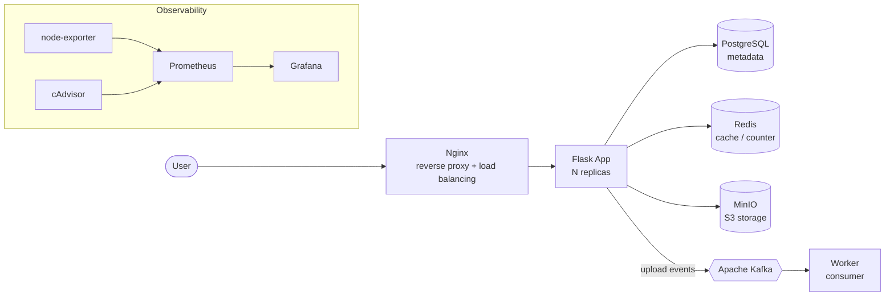

# ops-platform-lab — Document Vault


A hands-on platform that **deploys and operates** a small *Document Vault* service
with a full, production-style operations stack on a Linux host — then on a
Kubernetes cluster. Built to practice and demonstrate the skills of a
**System & Software Operations Engineer**.

**Author:** Cedric Severin DJIGUIMDE

## Architecture



An upload flows through the whole stack: the file is stored in **MinIO (S3)**, its
metadata in **PostgreSQL**, a counter is incremented in **Redis**, and an event is
published to **Kafka** and consumed by a **worker**. **Nginx** load-balances traffic
across app replicas; **Prometheus + Grafana** provide observability.

## Tech stack
| Layer | Technology |
|-------|------------|
| OS | Ubuntu (hardened: SSH keys, UFW, fail2ban) |
| Containers | Docker & Docker Compose |
| Application | Flask (Python) |
| Database | PostgreSQL |
| Cache / counters | Redis |
| Object storage (S3) | MinIO |
| Event bus | Apache Kafka (+ worker consumer) |
| Reverse proxy / load balancing | Nginx |
| Monitoring | Prometheus, Grafana, node-exporter, cAdvisor |
| Orchestration | Kubernetes (k3s) |
| CI / IaC | GitHub Actions, Ansible |

## Screenshots
| Grafana — host metrics | Kubernetes — pods |
|---|---|
|  |  |

## Quickstart (Docker Compose)
```bash
cp .env.example .env          # set strong passwords (MinIO password >= 8 chars)
docker compose up -d --build
docker compose ps
# App (via Nginx):  http://HOST_IP        MinIO console:  http://HOST_IP:9001
# Grafana:          http://HOST_IP:3000   Prometheus:     http://HOST_IP:9090
```

## Kubernetes (k3s)
```bash
kubectl apply -f k8s/app-deployment.yaml
kubectl get pods,svc
kubectl scale deployment/web --replicas=5     # scaling
kubectl rollout undo deployment/web           # rollback
```

## Automation
- **CI** — `.github/workflows/ci.yml` builds the app image and validates the Compose file on every push.
- **Provisioning** — `ansible/playbook.yml` installs Docker on a fresh host (idempotent).

## Full deployment guide
See **[docs/GUIDE.md](docs/GUIDE.md)** — step by step, from server hardening to Kubernetes.
