# ops-platform-lab — Document Vault


A hands-on platform that **deploys, secures, observes and continuously delivers** a
*Document Vault* service — a full, production-style operations stack on a hardened
Linux host, then on a Kubernetes cluster. Every uploaded file is stored, indexed,
and **scanned for viruses** through an event-driven pipeline. Built to demonstrate
the skills of a **System & Software Operations Engineer**.

**Author:** Cedric Severin DJIGUIMDE

## Highlights
- **Event-driven antivirus** — each upload triggers a Kafka worker that scans the file with **ClamAV** and records the verdict.
- **Full observability (3 pillars)** — metrics (**Prometheus**), logs (**Loki**), alerts (**Alertmanager**); Grafana dashboards provisioned as code.
- **Secure by default** — HTTPS/TLS, session authentication, **Docker secrets** (no plaintext passwords), **Trivy** image scanning in CI.
- **Orchestration** — Docker Compose *and* Kubernetes (k3s): scaling, self-healing, rolling updates, rollback.
- **Infrastructure as Code** — **Terraform** (validated in CI) + Ansible.
- **Continuous delivery** — pull-based **GitOps** deployment.

## Architecture

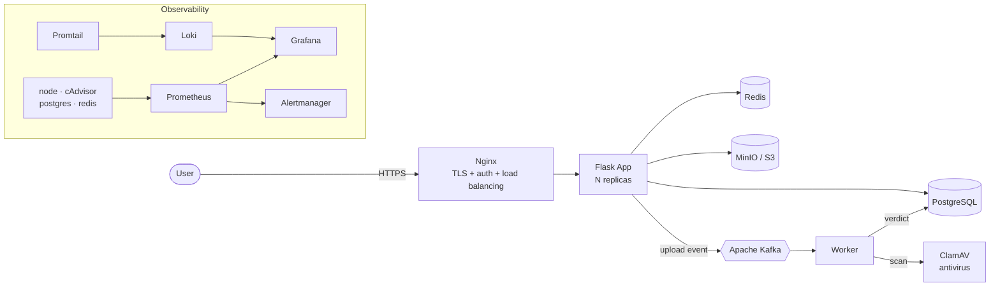

An upload flows through the whole stack: **Nginx** terminates TLS and checks the
session; the file is stored in **MinIO (S3)**, its metadata in **PostgreSQL**, a
counter is incremented in **Redis**, and an event is published to **Kafka**. A
**worker** consumes the event and **scans the file with ClamAV**, writing the verdict
(clean / infected) back to PostgreSQL. **Prometheus, Grafana, Loki and Alertmanager**
watch everything.

## Tech stack
| Layer | Technology |
|-------|------------|
| OS | Ubuntu — hardened (SSH keys, UFW, fail2ban), root FS on LVM |
| Containers | Docker & Docker Compose |
| Application | Flask (Python) |
| Security | HTTPS/TLS (Nginx), session auth, Docker secrets, Trivy image scanning |
| Database | PostgreSQL |
| Cache / counters | Redis |
| Object storage (S3) | MinIO |
| Event bus | Apache Kafka (+ worker consumer) |
| Antivirus | ClamAV (event-driven scan on upload) |
| Reverse proxy / load balancing | Nginx |
| Metrics | Prometheus + exporters (node, cAdvisor, postgres, redis) |
| Dashboards | Grafana (provisioned as code) |
| Logs | Loki + Promtail |
| Alerting | Alertmanager |
| Orchestration | Kubernetes (k3s) |
| CI | GitHub Actions (build, Trivy scan, Compose & Terraform validate) |
| IaC | Terraform (AWS), Ansible |
| CD | GitOps pull-based (systemd timer) |

## Screenshots

All dashboards are **provisioned as code** (data source + dashboards auto-loaded on startup).

**Grafana — host metrics (Node Exporter)**

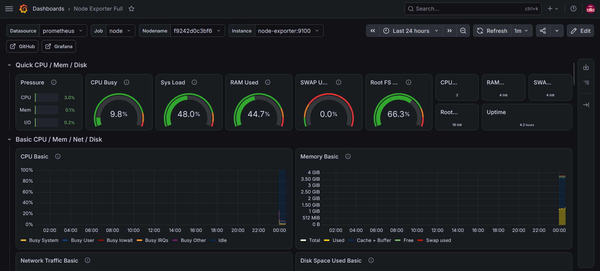

**Grafana — per-container metrics (cAdvisor)**

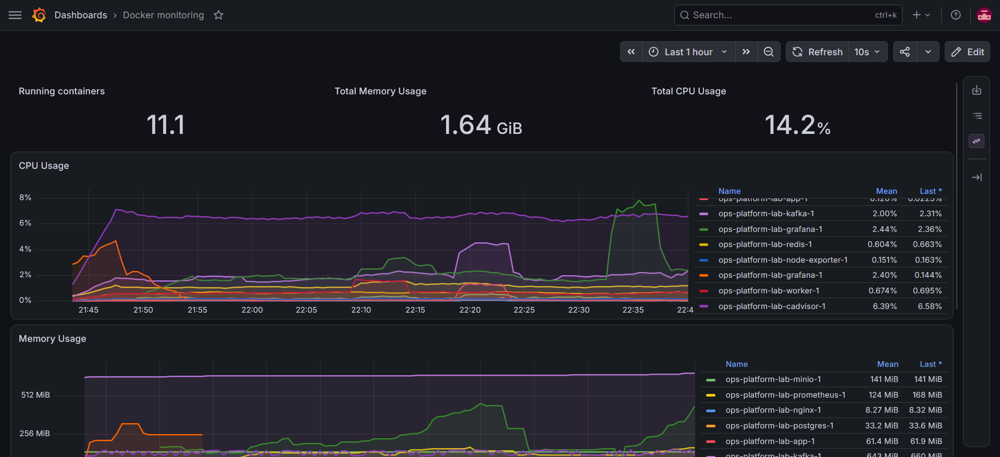

**Grafana — Prometheus internals (targets, TSDB, scrape health)**

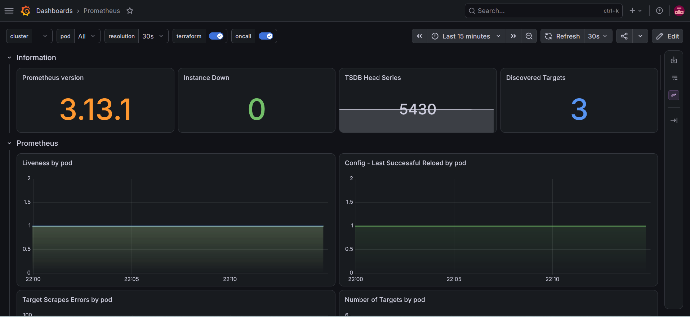

**Grafana — PostgreSQL (custom dashboard, built as code)**

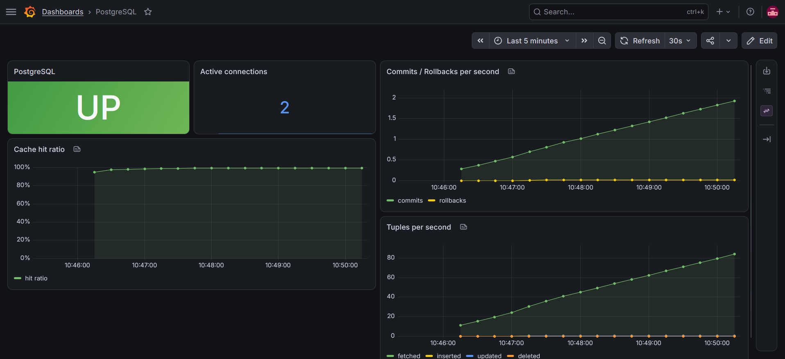

**Kubernetes — pods (k3s)**

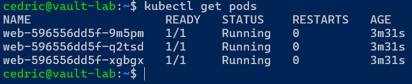

<details>
<summary><b>More monitoring views</b></summary>

**Docker monitoring — memory & network per container**

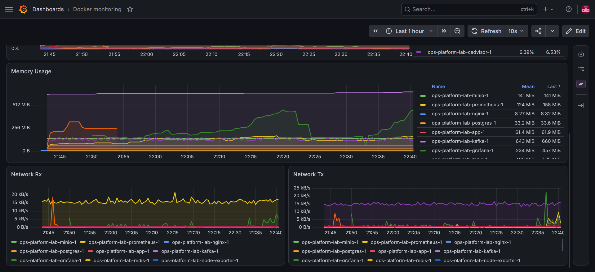

**Prometheus — scrape targets & sync**

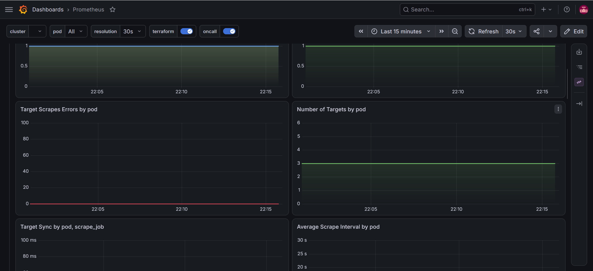

**Prometheus — TSDB internals**

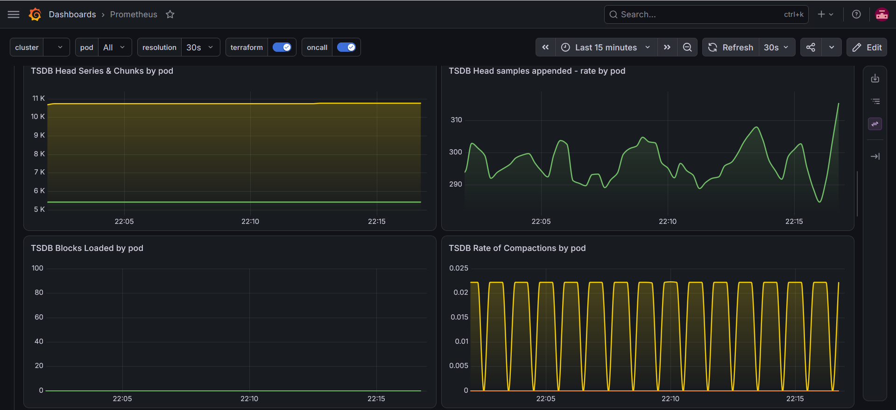

**Prometheus — query engine**

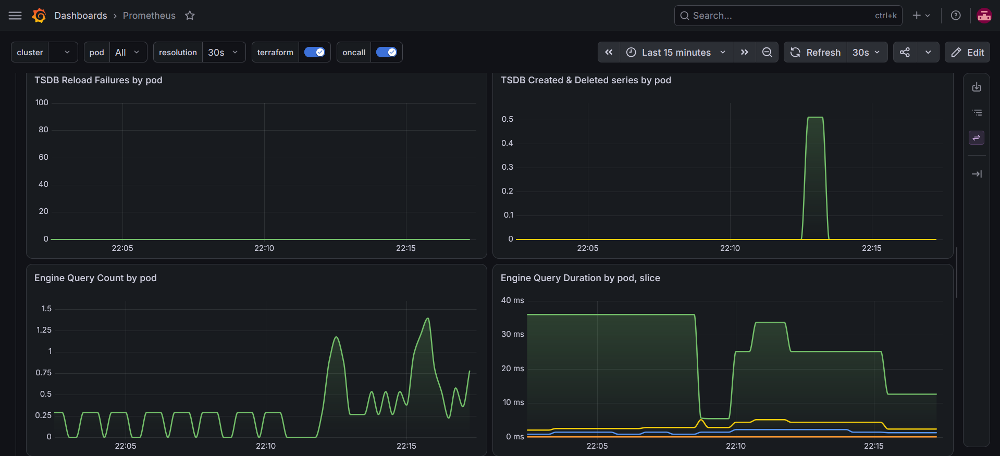

**Redis — exporter dashboard**

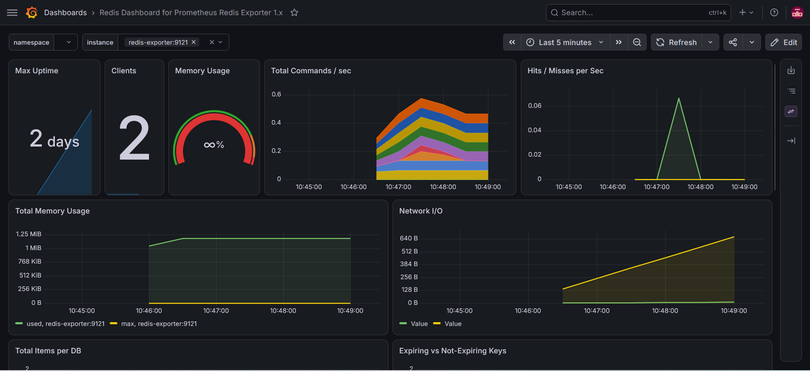

</details>

## Quickstart (Docker Compose)
```bash
cp .env.example .env                          # non-secret config (MINIO_USER)

# Docker secrets (see secrets/README.md)
mkdir -p secrets nginx/certs
printf '%s' "pg-password"    > secrets/postgres_password.txt
printf '%s' "minio-password" > secrets/minio_password.txt   # >= 8 chars
printf '%s' "admin-password" > secrets/admin_password.txt
openssl rand -hex 32         > secrets/secret_key.txt

# Self-signed TLS certificate for Nginx
openssl req -x509 -nodes -newkey rsa:2048 -days 365 \
  -keyout nginx/certs/vault.key -out nginx/certs/vault.crt -subj "/CN=vault"

docker compose up -d --build
# App (HTTPS via Nginx): https://HOST_IP     Grafana:      http://HOST_IP:3000
# Prometheus: :9090   Alertmanager: :9093    MinIO console: http://HOST_IP:9001
```

## Kubernetes (k3s)
```bash
kubectl apply -f k8s/app-deployment.yaml
kubectl get pods,svc
kubectl scale deployment/web --replicas=5     # scaling
kubectl rollout undo deployment/web           # rollback
```

## Delivery (CI/CD & IaC)
- **CI** — `.github/workflows/ci.yml`: builds the app image, **scans it with Trivy**, and validates the Compose file and the Terraform config on every push.
- **CD** — pull-based **GitOps**: a systemd timer (`scripts/vault-deploy.timer`) reconciles the host with `origin/main` every 2 minutes.
- **IaC** — `terraform/` provisions the cloud VM (EC2 + security group + Docker bootstrap); `ansible/playbook.yml` installs Docker idempotently.

## Full deployment guide
See **[docs/GUIDE.md](docs/GUIDE.md)** — step by step, from server hardening to Kubernetes.
