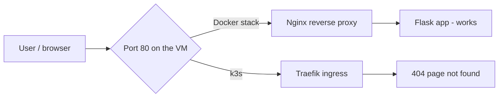

# Docker Compose vs Kubernetes — they are NOT meant to run together

## Common misconception

> "Docker Compose launches the containers, and Kubernetes then uses those
> containers to do autoscaling, replication, etc."

**This is wrong.** Docker Compose and Kubernetes are **two independent
orchestrators**. Kubernetes does **not** reuse Compose containers — it runs its
own containers (as *pods*) through its own runtime (**containerd**). You pick
**one** platform for a given application.

| | Docker Compose | Kubernetes |
|---|---|---|
| Scope | one host | a cluster of nodes |
| Runs containers via | the Docker engine | its own runtime (containerd) |
| Good for | small / dev / single server | scale, high availability |
| Autoscaling / self-healing | no | yes |

They both *run containers*, but each has its **own** engine. Running both for the
same app is only ever a **learning setup**, never production.

## Why they conflict in this lab

On a single machine, both fight for **port 80**:

- the Docker stack serves it with **Nginx**
- **k3s** serves it with **Traefik** (its default ingress controller)

And `sudo systemctl stop k3s` does **not** remove the iptables rules k3s installed,
so k3s keeps hijacking the external IP even when the service looks stopped.



## Symptom

- `curl https://localhost/` works — Nginx answers (HTTP 302 -> /login)
- but the browser on the **external IP** shows **`404 page not found`**
  (that plain-text 404 is Traefik's signature, not Nginx)

## Fix — fully remove k3s interference

```bash
# 1. Kill all k3s containers AND flush its iptables rules
sudo /usr/local/bin/k3s-killall.sh

# 2. Let Docker reinstall its own network rules
sudo systemctl restart docker

# 3. Bring the Docker stack back up
docker compose up -d

# 4. Verify (expect HTTP 302 + "Server: nginx")
curl -kI https://<VM_IP>/
```

## How to avoid it for good

1. **One owner of port 80 at a time.** When you are done with k3s, always run
   `sudo /usr/local/bin/k3s-killall.sh` (not just `systemctl stop k3s`).

2. **Disable Traefik in k3s** so it never touches port 80:

   ```bash
   sudo mkdir -p /etc/rancher/k3s
   printf 'disable:\n  - traefik\n' | sudo tee /etc/rancher/k3s/config.yaml
   sudo rm -f /var/lib/rancher/k3s/server/manifests/traefik.yaml
   ```

   Then reach Kubernetes services through their **NodePort** (e.g. `:30080`).

3. **In production, separate them entirely** — Docker Compose and Kubernetes never
   share a machine. Compose runs on its own VM; Kubernetes is a multi-node cluster.
