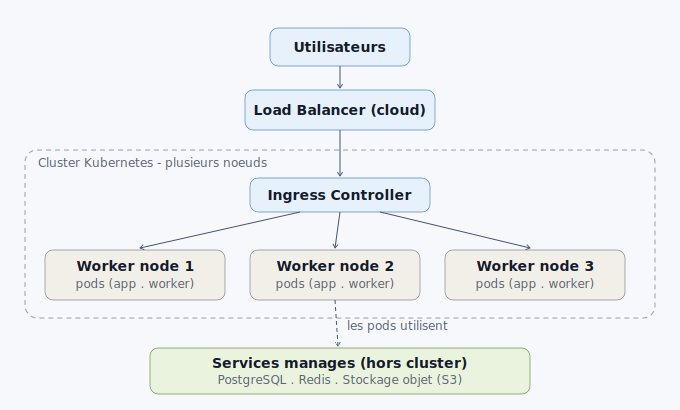
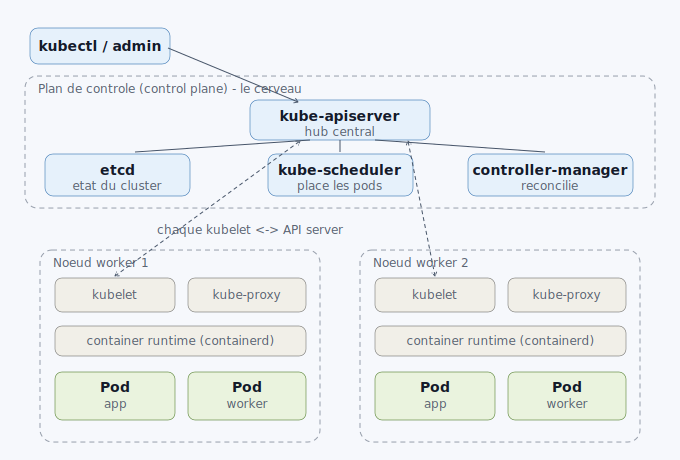

# Kubernetes architecture — notes

Two views of how Kubernetes works, and why it is not the same as the Docker
Compose stack in this lab.

> **Compose and Kubernetes are two separate orchestrators.** Kubernetes does not
> reuse the containers started by Docker Compose — it runs its own containers
> through its own runtime (containerd). You pick one per application, not both.
> See [docker-compose-vs-kubernetes.md](docker-compose-vs-kubernetes.md).

## 1. Production topology

In production you don't run Compose and Kubernetes together. For scale and high
availability you run a **multi-node Kubernetes cluster**: users hit a cloud load
balancer, an ingress controller routes to pods spread across worker nodes, and
stateful services (database, cache, object storage) are usually **managed
services outside the cluster**.

## 2. Cluster anatomy — control plane + workers

A cluster is **several machines**, not one VM:

**Control plane (the brain — pilots the cluster, does not run your apps):**

| Component | Role |
|-----------|------|
| `kube-apiserver` | Central hub — everything goes through it |
| `etcd` | Key-value store holding the cluster state |
| `kube-scheduler` | Decides which node runs each new pod |
| `kube-controller-manager` | Reconciliation loops — self-healing |

**Worker nodes (the muscle — run the pods):**

| Component | Role |
|-----------|------|
| `kubelet` | Node agent; talks to the API server, runs/watches pods |
| `kube-proxy` | Service networking (routes traffic to pods) |
| container runtime (containerd) | Actually runs the containers |
| Pods | Your containers (app, worker, ...) |

In production the control plane runs in **3 copies** for high availability, and
you add worker nodes to scale. A minimal HA cluster is therefore ~5-6 machines.

## Flow — what happens first

1. `kubectl apply` → **kube-apiserver**
2. The API server stores the desired state → **etcd**
3. **kube-scheduler** assigns the pods to worker nodes
4. Each node's **kubelet** tells the runtime to start its pods
5. **controller-manager** watches and recreates anything that dies (self-healing)
